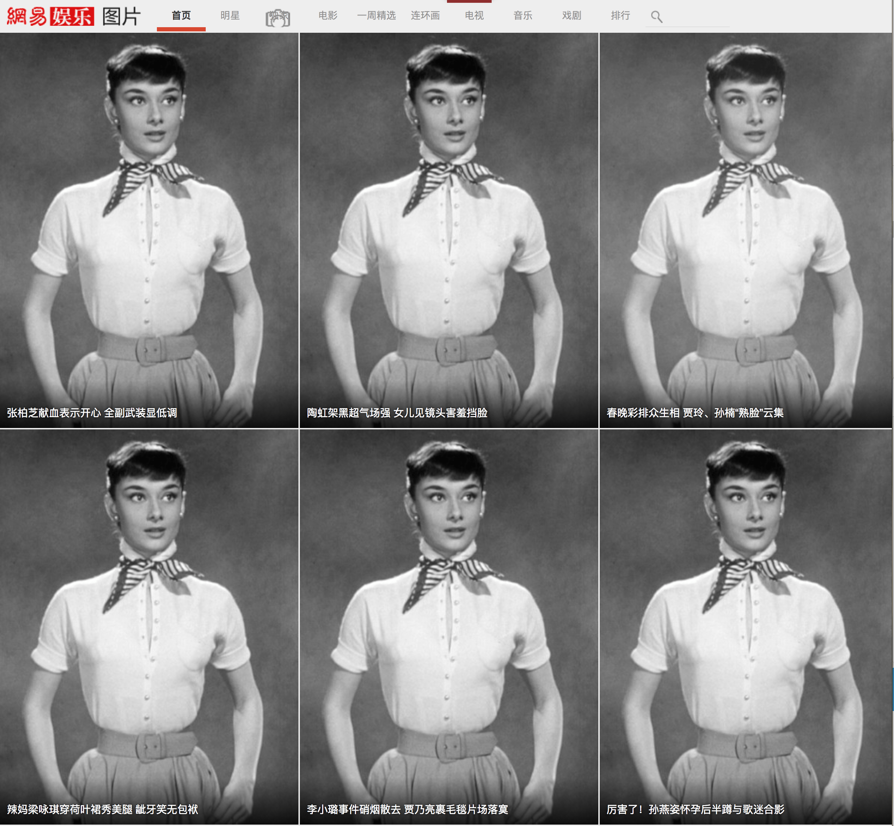
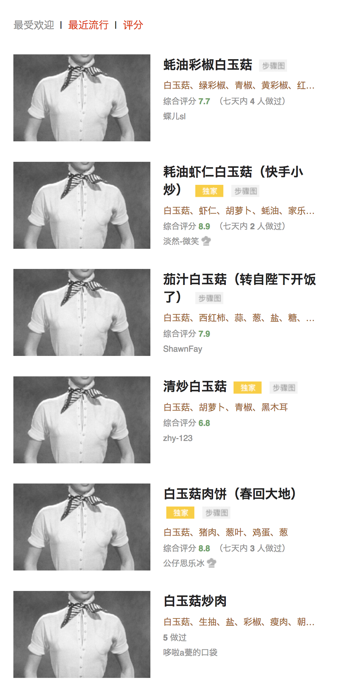

如果你找的是 Privoxy 配置文件 - 请查看旧[历史文件](https://github.com/chenxsan/Privoxy/tree/1ad6281701d639c2ff6802fd625a565dda1de810)，请注意，我已不再维护。

# Privoxy 与奥黛丽·赫本

这是一个关于 http 的试验。

如果你不熟悉 Privoxy，那么你只要知道[它能替换 http 协议的图片](https://blog.zfanw.com/block-webpage-ad-with-privoxy/)就好。

这一条 Privoxy 规则非常简单：

```
{+block +handle-as-image +set-image-blocker{https://upload.wikimedia.org/wikipedia/commons/9/98/Audrey_Hepburn_screentest_in_Roman_Holiday_trailer.jpg}}
/.*\.(jpg|jpeg|png|webp|bmp).*
```
这样，我就把所有 http 协议的图片都替换成奥黛丽·赫本，在浏览器上访问页面时，我会看到如下：





是了，所有这些站点图片都还在使用 http 协议，而不是 https。

## 图片许可说明

关于奥黛丽·赫本图片使用许可，请见 [Wikipedia 说明](https://upload.wikimedia.org/wikipedia/commons/9/98/Audrey_Hepburn_screentest_in_Roman_Holiday_trailer.jpg)。